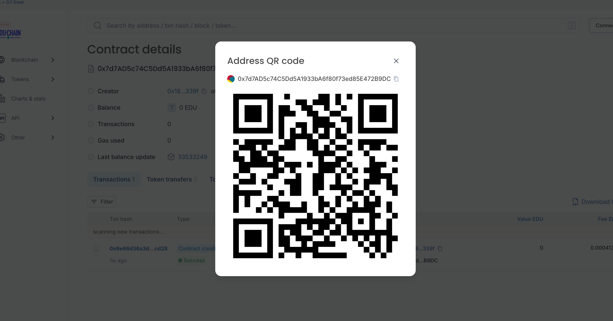

## 项目介绍
BCDN 是一个基于 EDU-CHAIN 链构建的去中心化内容创作平台，旨在为 Web3 开发者、爱好者和学习者提供一个集知识分享、技术交流、职业发展于一体的综合社区。通过结合区块链技术与内容创作的灵活性，BCDN 不仅是一个技术博客平台，更是一个支持创作者经济、促进 Web3 人才成长的创新空间。

BCDN is a decentralized content creation platform built on the EDU-CHAIN chain, which aims to provide a comprehensive community of knowledge sharing, technical exchange and career development for Web3 developers, enthusiasts and learners. By combining blockchain technology with the flexibility of content creation, BCDN is not only a technical blogging platform, but also an innovation space that supports the creator economy and promotes the growth of Web3 talent.

## 项目技术栈
- 前端：React + Ant Design
- 后端：Node.js + Express
- 数据库：MongoDB
- 智能合约：Solidity

- Front-end: React + Ant Design
- Back-end: Node.js + Express
- Database: MongoDB
- Smart contracts: Solidity

## 项目功能
- 去中心化内容发布
用户可以基于 EDU-CHAIN 链发布技术博客、教程、项目案例等内容，所有内容通过区块链技术进行存储和验证，确保内容的真实性和不可篡改。

- Web3 知识库与学习路径
平台提供丰富的 Web3 学习资源，涵盖智能合约开发、区块链技术、DeFi、NFT 等领域。同时，为初学者和进阶开发者提供定制化的学习路径。

- 代币激励机制
平台通过代币化激励机制，创作者可以通过发布高质量内容获得代币奖励，读者也可以通过打赏支持创作者。代币经济模型将基于 EDU-CHAIN 链实现，确保激励机制的透明性和去中心化。

- Web3 职业发展支持
平台提供开发者职位推荐、项目合作机会以及个人品牌建设工具，帮助用户在 Web3 领域找到合适的工作或合作伙伴。

- 社区与社交功能
用户可以关注其他创作者、参与讨论、加入兴趣小组，形成一个活跃的 Web3 开发者社区。

- 智慧问答
用户可以借助AI技术进行智慧问答，获取技术问题的解答和指导。

- Decentralized content distribution

Users can publish technical blogs, tutorials, project cases and other content based on the EDU-CHAIN chain, and all content is stored and verified by blockchain technology to ensure the authenticity of the content and cannot be tampered with.

- Web3 knowledge base and learning path

The platform provides rich Web3 learning resources, covering smart contract development, blockchain technology, DeFi, NFT and other fields. At the same time, it provides customized learning paths for beginners and advanced developers.

- Token incentive mechanism

Through the tokenized incentive mechanism, creators can receive token rewards by publishing high-quality content, and readers can also support creators through rewards. The token economy model will be implemented based on the EDU-CHAIN chain, ensuring transparency and decentralization of incentives.

- Web3 Career Development Support

The platform provides developer job recommendations, project collaboration opportunities, and personal brand building tools to help users find the right job or partner in the Web3 space.

- Community and social functions

Users can follow other creators, participate in discussions, and join interest groups to form an active Web3 developer community.

- Questions and Answers

Users can use AI technology to conduct intelligent questions and answers, and obtain answers and guidance for technical questions.

## 项目愿景
BCDN 致力于成为 Web3 领域的权威知识平台，帮助开发者和爱好者更好地学习、交流和成长。通过去中心化的技术架构和激励机制，我们希望构建一个更加开放、透明且可持续发展的内容创作社区，推动 Web3 技术的普及和发展。

BCDN is committed to being the authoritative knowledge platform in Web3, helping developers and enthusiasts learn, communicate and grow better. Through a decentralized technology architecture and incentive mechanism, we hope to build a more open, transparent and sustainable content creation community and drive the adoption and development of Web3 technology.

# 合约
合约地址：0x7d7AD5c74C5Dd5A1933bA6f80f73ed85E472B9DC

